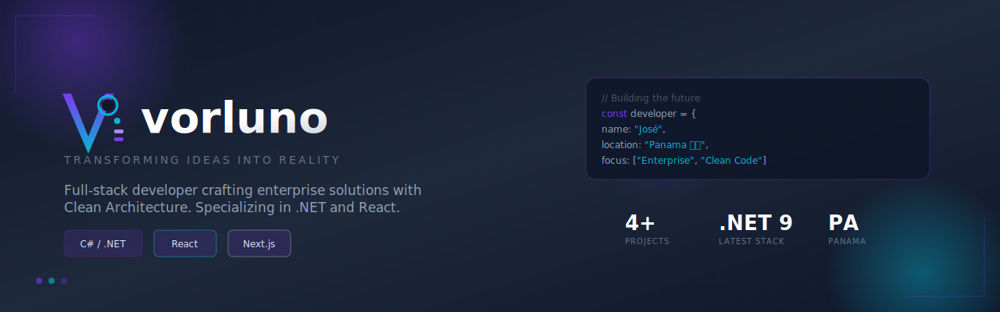

<!-- Header Banner -->
<div align="center">
  
</div>

<br>

<div align="center">
  
  [](https://vorluno.dev)
  [](www.linkedin.com/in/josé-gonzález-323b74248)
  [](contacto@vorluno.dev)

</div>

---

## About Me

Full-stack developer from **Panama 🇵🇦** specializing in enterprise software solutions. I build robust applications using **Clean Architecture** principles, combining the power of **.NET ecosystems** with modern **React/Next.js** frontends.

Currently focused on developing business applications that solve real-world problems, from payroll systems compliant with local regulations to digital solutions for the hospitality industry.

---

## 🛠️ Tech Stack

<div align="center">

### Backend
[](https://learn.microsoft.com/en-us/dotnet/csharp/)
[](https://dotnet.microsoft.com/)
[](https://dotnet.microsoft.com/en-us/apps/aspnet)
[](https://docs.microsoft.com/en-us/ef/core/)

### Frontend
[](https://react.dev/)
[](https://nextjs.org/)
[](https://www.typescriptlang.org/)
[](https://tailwindcss.com/)

### Database & Cloud
[](https://www.microsoft.com/sql-server)
[](https://www.postgresql.org/)
[](https://supabase.com/)
[](https://azure.microsoft.com/)

### DevOps & Tools
[](https://www.docker.com/)
[](https://github.com/features/actions)
[](https://caprover.com/)
[](https://visualstudio.microsoft.com/)

</div>

---

## 🚀 Featured Projects

<table>
<tr>
<td width="50%" valign="top">

### [📊 Vorluno-Planilla](https://github.com/vorluno/Vorluno-Planilla)
**Enterprise Payroll System for Panama**

Full-featured payroll management with CSS, Educational Insurance, and ISR compliance. Built with Clean Architecture principles.

[](https://dotnet.microsoft.com/)
[](https://react.dev/)
[](https://www.microsoft.com/sql-server)

`C#` `ASP.NET Core` `Entity Framework` `Clean Architecture`

</td>
<td width="50%" valign="top">

### [🍽️ Vorluno-Menu](https://github.com/vorluno/Vorluno-Menu)
**Digital Restaurant Menu PWA**

Modern Progressive Web App for restaurants with admin panel, bilingual support (ES/EN), and real-time updates.

[](https://nextjs.org/)
[](https://supabase.com/)
[](https://www.typescriptlang.org/)

`TypeScript` `React` `Tailwind CSS` `PWA` `i18n`

</td>
</tr>
<tr>
<td width="50%" valign="top">

### [📝 Vorluno-Form](https://github.com/vorluno/Vorluno-Form)
**Enterprise Contact Form Solution**

Production-ready contact form with Brevo email integration, Google Sheets webhook, and Docker deployment.

[](https://dotnet.microsoft.com/)
[](https://react.dev/)
[](https://www.docker.com/)

`C#` `Vite` `CapRover` `Brevo API`

</td>
<td width="50%" valign="top">

### [🌐 More Projects](https://github.com/vorluno?tab=repositories)
**Explore All Repositories**

Check out my other projects including utilities, experiments, and contributions to the developer community.

[](https://github.com/vorluno?tab=repositories)

</td>
</tr>
</table>

---

## 📈 GitHub Stats

<div align="center">
  
  
</div>

---

## 💡 Core Principles

```csharp
public class DevelopmentPhilosophy
{
    public string[] CorePrinciples => new[]
    {
        "Clean Architecture - Separation of concerns is not optional",
        "No Magic Deletes - Always soft delete, always audit",
        "Test Everything - If it's not tested, it doesn't work",
        "SOLID by Default - Write code that's easy to change"
    };

    public string Motto => "Transforming Ideas Into Reality";
}
```

---

<div align="center">

### Let's Connect!

I'm always interested in discussing new projects, creative ideas, or opportunities to be part of something amazing.

[](https://vorluno.dev)
[](https://github.com/vorluno)

---

<sub>Made with 💜 in Panama 🇵🇦</sub>

</div>
